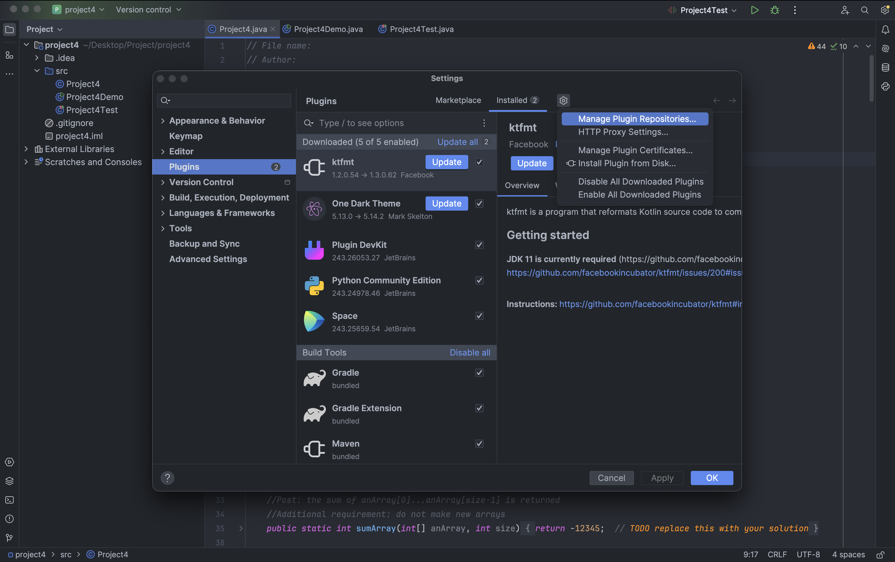
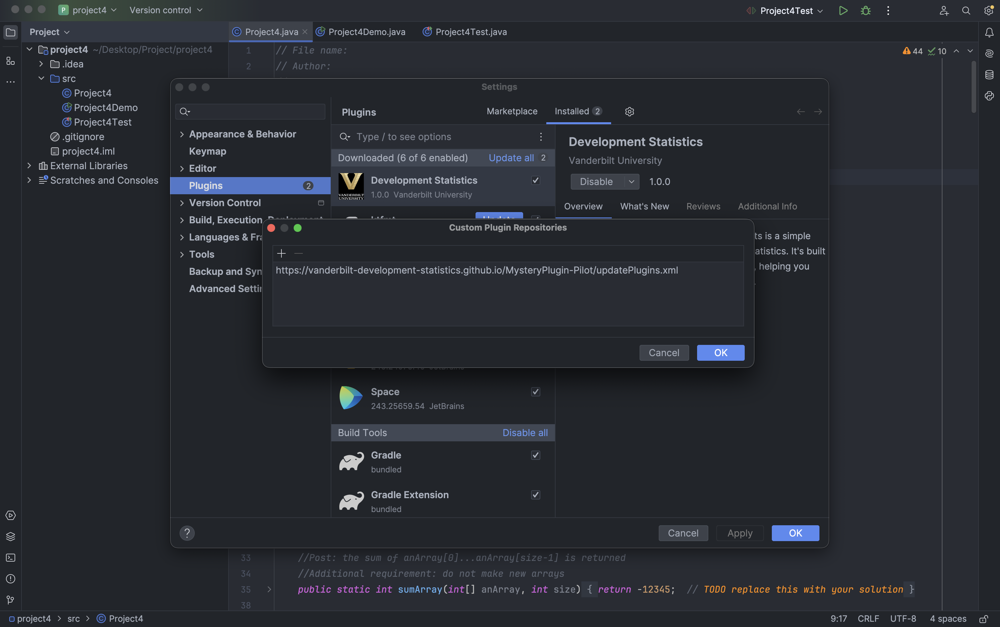
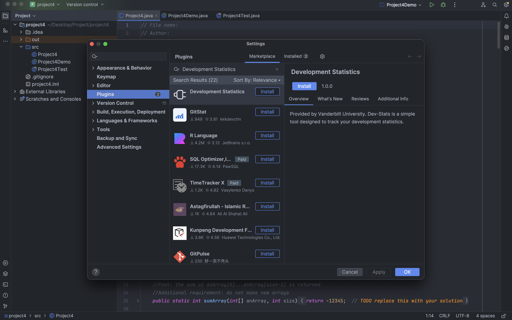
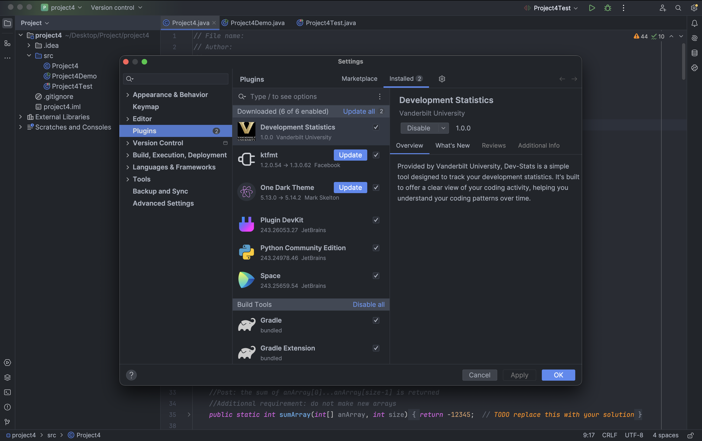

# Development Statistics — Pilot Study

**Vanderbilt University · Computer Science Department**

Welcome! You've been invited to participate in a pilot study for **Development Statistics (Dev-Stats)**, a lightweight IntelliJ IDEA plugin that tracks users' coding activity as they work through a programming assignment. The data collected helps researchers at Vanderbilt understand how students approach development tasks.

This guide walks you through everything you need to get set up. It should take about **5 minutes**.

---

## Task

Your objective for this study is straightforward: **complete the programming assignment while doing your best to "cheat."** Use any external resources you'd like — search engines, AI tools, other students' code, Stack Overflow, etc. The goal is to solve the problems by any means necessary.

Here's an overview of the steps:

1. **Download and install IntelliJ IDEA** (2023.3 or newer)
2. **Add the plugin repository** and install the Development Statistics plugin
3. **Download and open the project files** (the Recursions project)
4. **Start a screen recording** of your session
5. **Complete the assignment**, using whatever resources you'd like
6. **Submit your recording** via Google Form

Detailed instructions for each step are provided below.

---

## Prerequisites

- A computer running **Windows**, **macOS**, or **Linux**
- **IntelliJ IDEA 2023.3 or newer** (Community or Ultimate)
- An internet connection
- A screen recording tool (see [Step 6](#step-6-start-screen-recording))

> **Important:** The plugin requires **IntelliJ IDEA 2023.3 or newer**. If you already have an older version installed, please update it before continuing. The latest release from JetBrains will always work.

---

## Step 1: Download IntelliJ IDEA

> **Already have IntelliJ IDEA 2023.3 or newer?** Skip to [Step 2](#step-2-add-the-plugin-repository).

1. Go to the [IntelliJ IDEA download page](https://www.jetbrains.com/idea/download/).
2. Download the installer for your operating system. **Make sure it is version 2023.3 or newer** — any current version on the JetBrains download page will work.

   

3. Run the installer and follow the on-screen instructions.
4. Launch IntelliJ IDEA. You should see the welcome screen:

   
5. **Verify your version:** On the welcome screen, the version number is shown in the bottom-right corner (e.g., "2024.3"). On macOS, you can also check via **IntelliJ IDEA > About IntelliJ IDEA**; on Windows/Linux, via **Help > About**. Confirm it is **2023.3 or newer** before continuing.

---

## Step 2: Add the Plugin Repository

1. From the welcome screen, click **Plugins** on the left sidebar.
   - *Already have a project open?* Go to **File > Settings** (Windows/Linux) or **IntelliJ IDEA > Settings** (macOS), then select **Plugins**.
2. Click the **gear icon** near the top of the Plugins window (next to "Marketplace" and "Installed").
3. Select **Manage Plugin Repositories...** from the dropdown.

   

4. Click **+** and paste the following URL:
   ```
   https://vanderbilt-development-statistics.github.io/MysteryPlugin-Pilot/updatePlugins.xml
   ```

   

5. Click **OK** to save.

---

## Step 3: Install the Plugin

1. Switch to the **Marketplace** tab in the Plugins window.
2. Search for **"Development Statistics"**.
3. Click **Install**.

   

4. If prompted, restart the IDE to activate the plugin.

> **Note:** When you open the project files in Step 5, IntelliJ may also prompt you to install the plugin automatically. You can install it from either place.

---

## Step 4: Verify the Plugin is Enabled

1. Go to the **Installed** tab in the Plugins section.
2. Find **"Development Statistics"** in the list and make sure it is enabled.

   

3. Restart the IDE if prompted.

---

## Step 5: Download and Open the Project Files

1. On this page, click the green **Code** button and select **Download ZIP**.

   

2. Unzip the downloaded file.
3. Inside the unzipped folder, navigate to the **Project** directory and unzip **recursions.zip**.
4. Open the project in IntelliJ IDEA:
   - **From the welcome screen:** Click **Open** and navigate to the unzipped project folder.
   - **From an open project:** Go to **File > Open** and select the project folder.

---

## Step 6: Start Screen Recording

Before you begin working, please start a screen recording of your entire session. You can use any recording tool you prefer. Here are two free options:

| Tool | Platform | Tutorial |
|------|----------|----------|
| QuickTime Player | macOS | [Watch tutorial](https://www.youtube.com/watch?v=qwkW9hk1Brk) |
| VLC Player | Windows / macOS / Linux | [Watch tutorial](https://www.youtube.com/watch?v=zPU0YS7t7xY) |

Once your recording is running, you're ready to start working on the assignment.

---

## Step 7: Submit Your Recording

When you've finished the assignment, stop your screen recording and upload the video using the link below:

**[Submit Recording (Google Form)](https://forms.gle/oV5oh5cZcFxN5PKy8)**

---

## Troubleshooting

| Issue | Solution |
|-------|----------|
| Plugin doesn't appear in Marketplace | Make sure you added the repository URL in Step 2, then close and reopen the Plugins window. Also confirm your IDE version is **2023.3 or newer** — older versions will not show the plugin. |
| "Plugin is incompatible" or "not compatible with this version of IntelliJ IDEA" | Your IDE is older than 2023.3. Update IntelliJ IDEA via **Help > Check for Updates**, or download the latest version from [the JetBrains website](https://www.jetbrains.com/idea/download/). |
| "Connection failed" when adding the repository | Check your internet connection and try again. If you're on a VPN, try disconnecting first. |
| Plugin installed but not working | Go to **Plugins > Installed**, confirm "Development Statistics" is enabled, and restart the IDE. |
| IntelliJ won't open the project | Make sure you unzipped the download first — don't try to open the `.zip` file directly. |

---

## FAQ

**Q: Which version of IntelliJ should I use?**
Any version from **2023.3** or newer will work, including the latest release.

**Q: Does the plugin work with other JetBrains IDEs?**
The plugin is built for IntelliJ IDEA. It may work in other JetBrains IDEs, but IntelliJ IDEA is recommended.

**Q: Will the plugin slow down my IDE?**
No. The plugin is lightweight and runs in the background without affecting IDE performance.

**Q: Do I need to do anything to keep the plugin updated?**
No. Once installed, the plugin will automatically update when new versions are released.

---

## Need Help?

If you run into any issues not covered above, please reach out to the research team at [cameron.j.scarpati@vanderbilt.edu](mailto:cameron.j.scarpati@vanderbilt.edu).

---

*Vanderbilt University Development Statistics Research Project*
