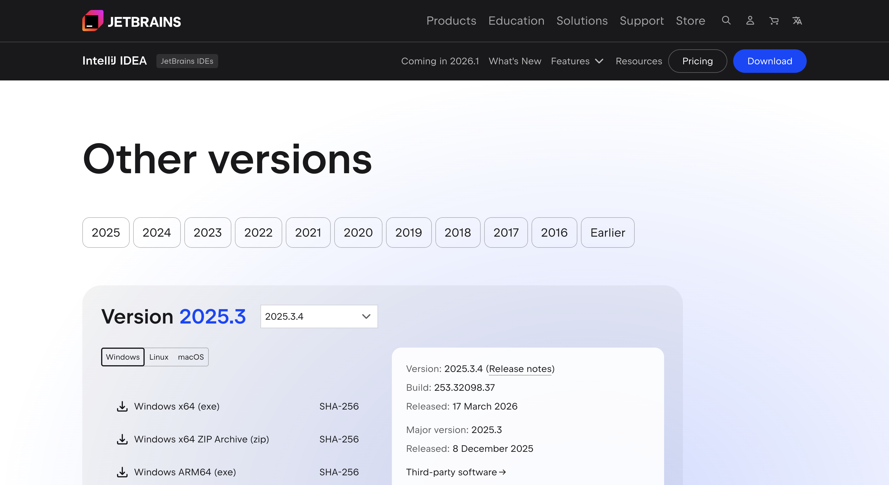
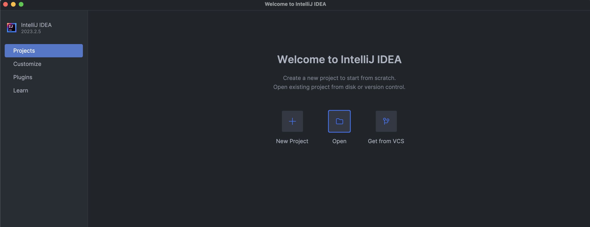
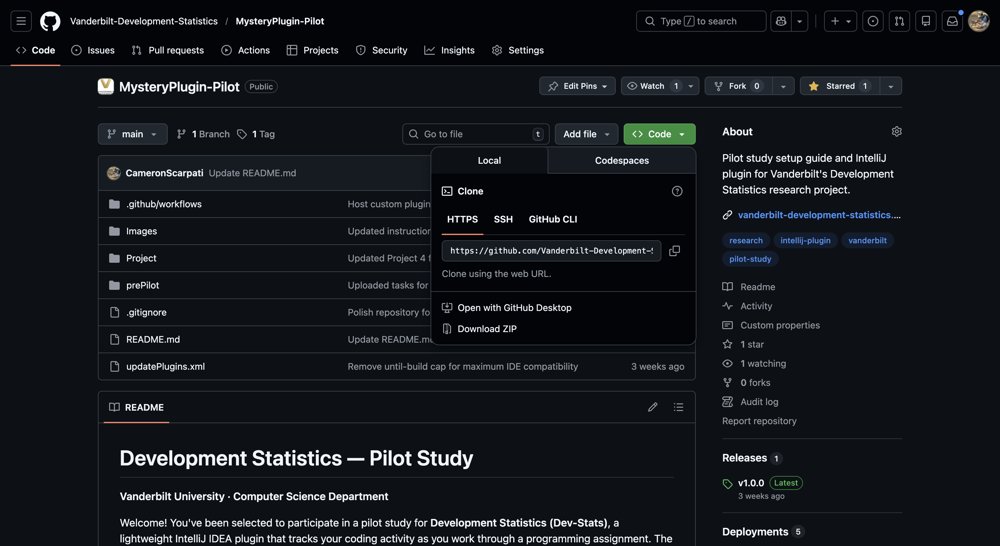
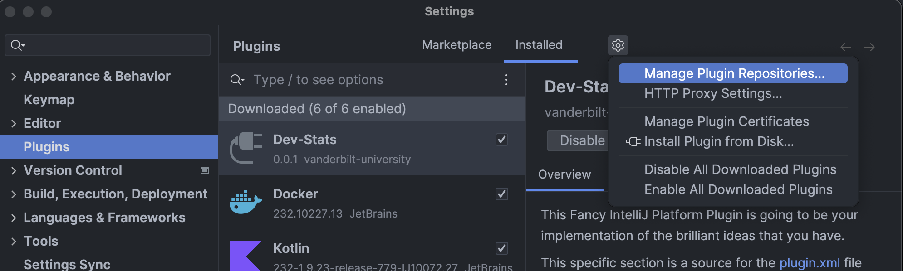
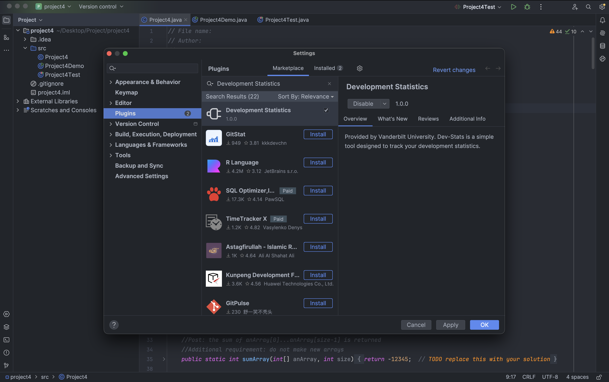

# MysteryPlugin-Pilot

### Step 1: Download IntelliJ IDEA
- Navigate to the JetBrains official website to download IntelliJ IDEA by going to this link: [IntelliJ IDEA Download](https://www.jetbrains.com/idea/download/other.html).
- Look for the "Community Edition" section. This version is free to use.

- Click on the download link for your operating system (Windows, macOS, or Linux).
- After the download is complete, run the installer and follow the on-screen instructions to install IntelliJ IDEA on your computer.
- Open IntelliJ IDEA. Upon launching, you might see a welcome screen if no projects are open.


### Step 2: Download the Plugin and Project Files from this Repo
- Click the Green "Code" button and select "Download ZIP".


### Step 3: Download Docker and Docker Desktop following the instructions for your Operating System below.
[Docker Download Instructions](https://docs.docker.com/get-started/get-docker/).

### Step 4: Download and Install the AWS CLI
- Follow the instructions for your operating system: [AWS CLI Installation](https://docs.aws.amazon.com/cli/latest/userguide/install-cliv2.html)

### Step 5: Configure the AWS CLI with your IAM user
- Run the following command and enter your IAM user credentials:
```
aws configure
```
This will prompt you to enter:

- AWS Access Key ID: **Attached in the text file sent to you (Do not put double or single quotes)**
- AWS Secret Access Key: **Attached in the text file sent to you (Do not put double or single quotes)**
- Default region name: us-east-1
- Default output format: json

### Step 5.5 (**Optional Windows Users**): Configure the HOME Variable
- If you are a Windows user, you may need to set the Home Variable, so that the AWS connection in the application knows where your IAM user is.

### Step 6: Unzip dev-stats-api **Attached in the email sent to you**

### Step 7: Ensure Docker Daemon is Running (Docker Desktop is Open) and Open a Terminal
- In the terminal, cd to the dev-stats-api directory and run the following commands in sequence.

```
docker compose build
docker compose up
```

### Step 8: Open IntelliJ IDEA and Accessing the Plugin Section
- Look for the "Plugins" button on the left side of the welcome screen and click it. If you already have a project open, navigate to "File" > "Settings" (on Windows/Linux) or "IntelliJ IDEA" > "Settings" (on macOS), and then select "Plugins" from the sidebar.

### Step 9: Install the Plugin from Disk
- Inside the Plugins window, click on the settings cog icon located near the top of the window, beside the "Marketplace" and "Installed" tabs.
- From the dropdown menu, select "Install Plugin from Disk…".
- A file explorer window will open. Navigate to the folder where you saved the plugin zip file, select the zip file, and click "OK" or "Open" to proceed.

- IntelliJ IDEA will install the plugin from the provided zip file. Follow any additional on-screen instructions to complete the installation.

### Step 10: Enable the Plugin
- After installation, if the plugin is not automatically enabled, you will need to manually enable it.
- Still in the "Plugins" section, go to the "Installed" tab where you'll see a list of all installed plugins.
- Find the newly installed plugin in the list. If it's disabled, there will be an "Enable" button next to it. Click "Enable".

- IntelliJ IDEA may require a restart to activate the plugin fully. If prompted, restart the IDE.

### Step 11: Open the Project File
- Return to the IntelliJ IDEA welcome screen by closing any open project (File > Close Project) or when starting IntelliJ IDEA.
- Click on "Open" and navigate to the location where you saved the "Project #4" file.
- Select the project file and click "OK" to open it in IntelliJ IDEA.

### Step 12: Start screen recording
- Tool suggestions: QuickTime Player [(Tutorial)](https://www.youtube.com/watch?v=qwkW9hk1Brk), VLC Player [(Tutorial)](https://www.youtube.com/watch?v=zPU0YS7t7xY)...

### Step 13: Congratulations, you are ready to start!!! 
- With the project open and the plugin installed, you are now ready to begin working on your project in IntelliJ IDEA. Explore the project structure, and start coding or reviewing the project files as required for your course.

### Step 14: Start screen recording and submit the video
- Please upload your screen capture video via: [Google Form](https://forms.gle/oV5oh5cZcFxN5PKy8).

### Step 15: Clear AWS user and delete email that was sent to you with the credentials.
- Go to your terminal again and type in ```aws configure``` and then put in random symbols for the regular and secret access keys to ensure nothing gets leaked.

Note: these steps are designed to guide you through the setup process smoothly. Adjustments might be needed based on your specific requirements or changes in software versions.
